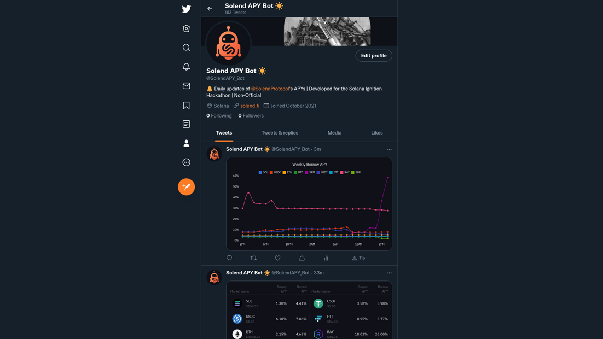
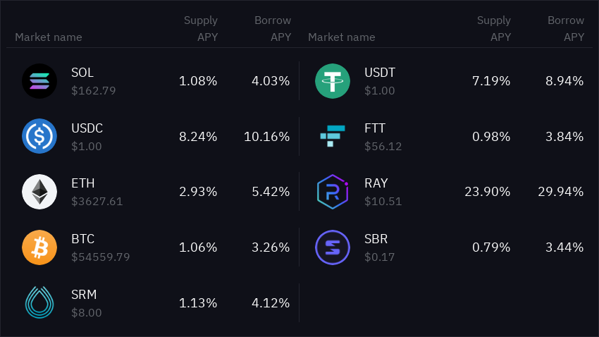
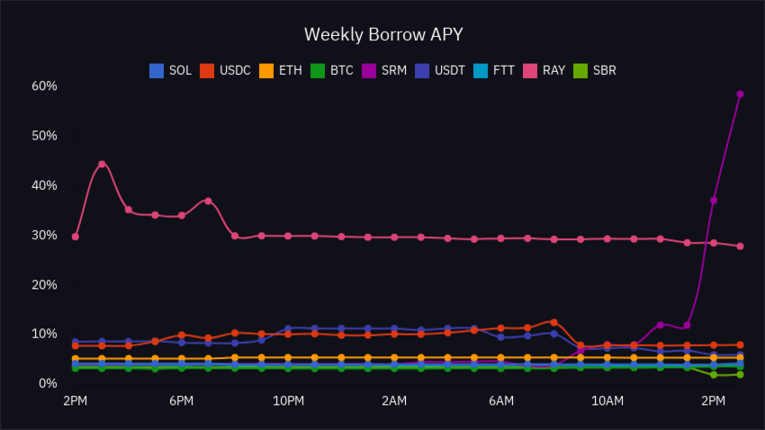
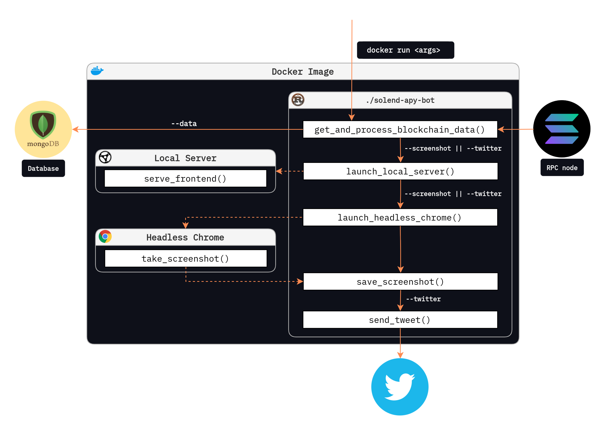

<!-- HEADER -->
<br />
<p align="center">
  <a href="https://github.com/manugildev/solend-apy-bot/">
    
  </a>
  <h3 align="center">Solend APY Twitter Bot</h3>

  <p align="center">
    Solana Ignition Hackathon 2021
    <br />
    <br />
    <a href="https://twitter.com/solendapy_bot">View Demo</a>
    ·
    <a href="https://github.com/manugildev/solend-apy-bot/issues">Report Bug</a>
    ·
    <a href="https://github.com/manugildev/solend-apy-bot/issues">Request Feature</a>
  </p>
</p>

<hr/>

<!-- TABLE OF CONTENTS -->
<h2>Table of Contents</h2>
<ul>
  <li>
    <a href="#about-the-project">About The Project</a>
    <ul>
      <li><a href="#motivation">Motivation</a></li>
      <li><a href="#challenges">Challenges</a></li>
      <li><a href="#architecture">Architecture</a></li>
      <li><a href="#future-work">Future Work</a></li>
    </ul>
  </li>
  <li>
    <a href="#installation">Installation</a>
    <ul>
      <li><a href="#prerequisites">Prerequisites</a></li>
      <li><a href="#building">Building</a></li>
    </ul>
  </li>
  <li><a href="#usage">Usage</a></li>
  <li><a href="#license">License</a></li>
  <li><a href="#acknowledgements">Acknowledgements</a></li>
</ul>
<hr/>

<!-- ABOUT THE PROJECT -->

## About The Project
 [@SolendAPY_bot](https://twitter.com/solendapy_bot) is an autonomous Twitter bot that posts analytics of the APYs available in the [Solend Protocol](https://solend.fi). Since a picture is worth a thousand words, instead of posting the APYs as a text we built an image generator to make the data more appealing for the followers. On Sundays, a weekly chart is automatically sent to better show the trend of the data for each token. Discord and Telegram bots can automatically mirror tweets right into a channel, making data accessible for users on other platforms.

The idea came from a [tweet](https://twitter.com/solendprotocol/status/1437059482329047042) where the Solend creators proposed valuable projects for the community.

<div align="center">
  <a href="https://twitter.com/solendapy_bot">
    
  </a>
  <p style="font-style: italic;"> Go to <a href="https://twitter.com/solendapy_bot"> @SolendAPY_bot</a> to see the bot in action</p>
</div>

### Motivation
- Give [Solend](https://solend.fi) users updated and transparent APY information on their Twitter feed, so that they can make decisions on how to efficiently lend and borrow their tokens
- Build the foundation of an analytics website for Solend to show the trends on APYs and other stats. Solend does not currently provide any official solution for this.
- Contribute to Solend's growth
- Learn new technologies by building a project

<div align="center">
  <a href="https://twitter.com/solendapy_bot">
    
  </a>
  <a href="https://twitter.com/solendapy_bot">
    
  </a>
  <p style="font-style: italic;">Example images generated by the bot</p>
</div>

### Challenges
Generating images programatically can be quite challenging, most of the tools and libraries available are not very flexible and definitely not as responsive as the web can be. That's why we decided to go the extra mile, create a frontend, launch a server locally and take screenshots of the tables and charts using headless chrome. This choice increased the dependencies the bot relies on, hence the needed of dockerizing it to make it robust and portable.

### Architecture
The bot lives inside a docker image for portability and simplicity reasons. The container has all the required dependencies for the `./solend-apy-bot` rust binary to run successfully, such as the static files for the frontend or headless chrome to take the screenshots. Once execution has finished, all the artifacts generated by the bot are thrown away. In order to save the data points needed to generate the weekly summary chart, a mongodb database is hosted outside of the docker container.
<div align="center">
  
</div>

### Future work
- Retrieve other useful information such as TVL, total borrow and supply quantities, etc.
- Eventually evolve into an interactive analytics website for Solend
- Keep adding new tokens as soon as they are listed on [solend.fi](https://solend.fi)
- Clean the code and make it bulletproof since some errors are currently not being handled

Feel free to [submit](https://github.com/manugildev/solend-apy-bot/issues) any feature request you would like to see implemented

<hr/>

<!-- INSTALLATION -->

## Installation
To get a local copy up and running follow these simple steps.

### Prerequisites

- Get `docker` for your platform [docker.com/get-started](https://www.docker.com/get-started)
- Create a `.env` file with all your keys following the format in [env.example](/.env.example)

### Building
1. Clone the repo
   ```sh
   git clone https://github.com/manugildev/solend-apy-bot.git
   ```
2. Build docker image
   ```sh
   docker build -t solend-apy-bot:1.0 .
   ```

<!-- USAGE -->
### Usage

Once the docker image has been built, run it with the `.env` file.
```sh
docker run -it --env-file=.env solend-apy-bot:1.0 <args>
```

Possible arguments that you can pass when running the docker image:
```
FLAGS:
    -h, --help                Prints help information
    -s, --screenshot          Takes screenshot and saves it locally
    -c, --chart               Generates a chart and saves it locally
    -t, --twitter             Posts screenshot to Twitter
    --server                  Launches a local server for debugging purposes

OPTIONS:
    -d, --data <data_type>    Saves data in database [default: MINUTE]
                              [possible values: MINUTE, HOUR, DAY, WEEK]
```
You can checkout how we are running the bot in our server using [cron jobs](/crontab)

<!-- LICENSE -->

## License

Distributed under the MIT License. See [`LICENSE`](/LICENSE) for more information.

<!-- ACKNOWLEDGEMENTS -->

## Acknowledgements

- [Solend's Discord Sever](https://discord.gg/aGXvPNGXDT) - The community using Solend have been truly inspiring and welcoming
- [Solana Program Library (Solend's fork)](https://github.com/solendprotocol) - Thanks to being an open source project I was able to easily extract and understand the data from the RPC requests

<hr/>

> Made with 💜 by [HyperManu](https://twitter.com/hyprmanu)

<!-- DEVPOST 

<br />
<p align="center">
  <a href="https://twitter.com/solendapy_bot">
    
  </a>
</p>

## Elevator Pitch
@SolendAPY_bot is an autonomous Twitter bot that posts analytics of the APYs available in the Solend Protocol so that users can make decisions on how to efficiently lend and borrow their tokens.

## Motivation
- Give [Solend](https://solend.fi) users updated and transparent APY information on their Twitter feed, so that they can make decisions on how to efficiently lend and borrow their tokens
- Build the foundation of an analytics website for Solend to show the trends on APYs and other stats. Solend does not currently provide any official solution for this.
- Contribute to Solend's growth
- Learn new technologies by building a project

The idea came from a [tweet](https://twitter.com/solendprotocol/status/1437059482329047042) where the Solend creators proposed valuable projects for the community.

## What it does
A cronjob summons @SolendAPY_bot every once in a while to gather data from the Solend addresses, and post the generated images to Twitter. You don't need to navigate to [solend.fi](https://solend.fi) every five minutes to see what is the current APY, you have it right on your feed! Analyze the trends and invest your crypto wisely!

<div align="center">
  <a href="https://twitter.com/solendapy_bot">
    
  </a>
  <a href="https://twitter.com/solendapy_bot">
    
  </a>
</div>

 > _Example images generated by the bot_
 
## How we built it
The bot lives inside a docker image for portability and simplicity reasons. The container has all the required dependencies for the `./solend-apy-bot` rust binary to run successfully, such as the static files for the frontend or headless chrome to take the screenshots. Once execution has finished, all the artifacts generated by the bot are thrown away. In order to save the data points needed to generate the weekly summary chart, a mongodb database is hosted outside of the docker container.


## Challenges we ran into
Generating images programatically can be quite challenging, most of the tools and libraries available are not very flexible and definitely not as responsive as the web can be. That's why we decided to go the extra mile, create a frontend, launch a server locally and take screenshots of the tables and charts using headless chrome. This choice increased the dependencies the bot relies on, hence the needed of dockerizing it to make it robust and portable.

## Accomplishments that we're proud of
- Fetched and unpacked on-chain data from Solend addresses
- Generated eye-catching images 
- Made the bot stateless
- Kept execution time of less than 1 second (from call to tweeting the image)
- Saved data points on external database for weekly summary charts

## What we learned
I had the opportunity of using Solana, Vue, Docker MongoDB and Actix for the first time and learnt a lot in the process!

## What's next for Solend APY Twitter Bot
- Retrieve other useful information such as TVL, total borrow and supply quantities, etc.
- Eventually evolve into an interactive analytics website for Solend
- Keep adding new tokens as soon as they are listed on [solend.fi](https://solend.fi)
- Clean the code and make it bulletproof since some errors are currently not being handled

Feel free to [submit](https://github.com/manugildev/solend-apy-bot/issues) any feature request you would like to see implemented.
-->